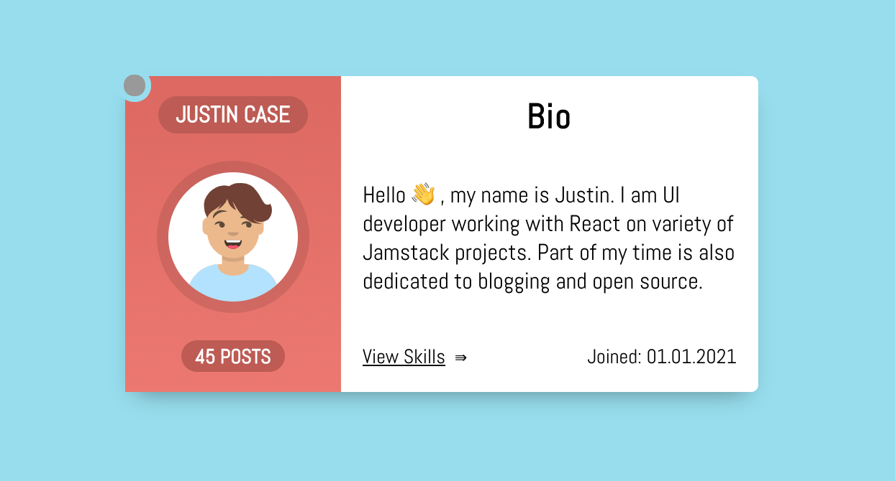

# Profile Card React Component

This project was bootstrapped with [Create React App](https://github.com/facebook/create-react-app).



## Dev setup
```
yarn
```
or 
```
npm install
```
in the project's root folder.

To run the app in the development mode:
```
yarn start
```
Then open [http://localhost:3000](http://localhost:3000) to view the app in the browser.

## Running the tests
```
yarn test
```
Launches the test runner in interactive watch mode.

## Credits
This card design is inspired by [alvaromontoro](https://github.com/alvaromontoro)'s [Player/User Cards](https://codepen.io/alvaromontoro/pen/ebPEWb)

Find more React and Front-end guides at [webup.org/blog](https://webup.org/blog)
